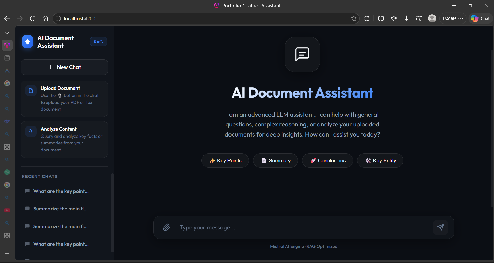
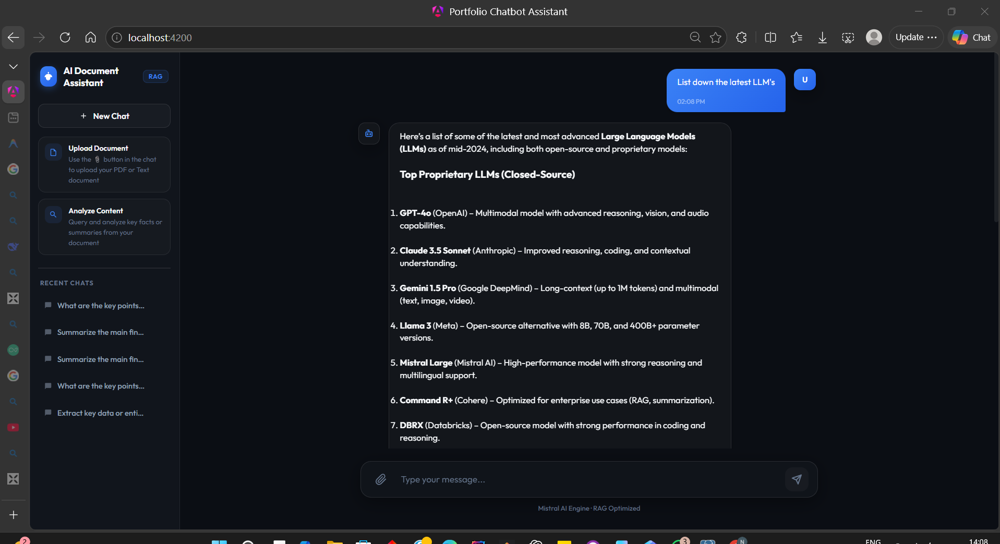
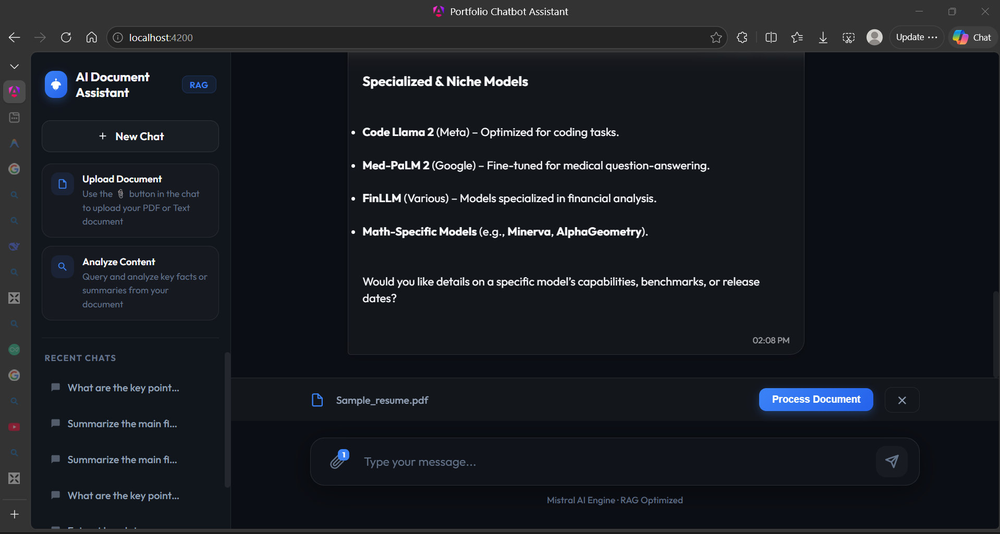
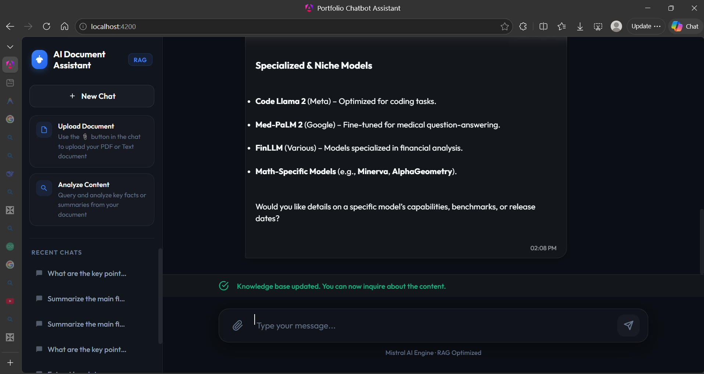
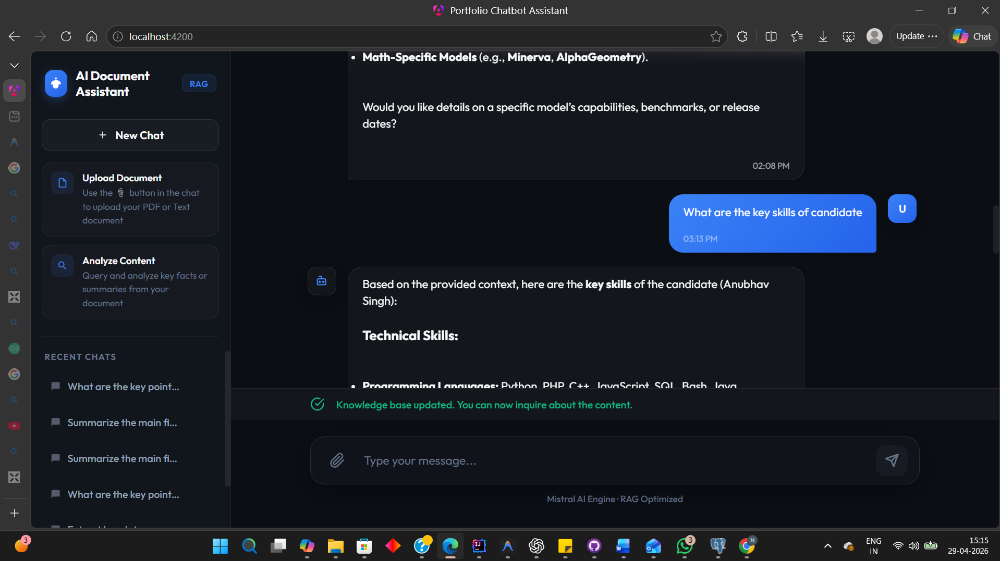
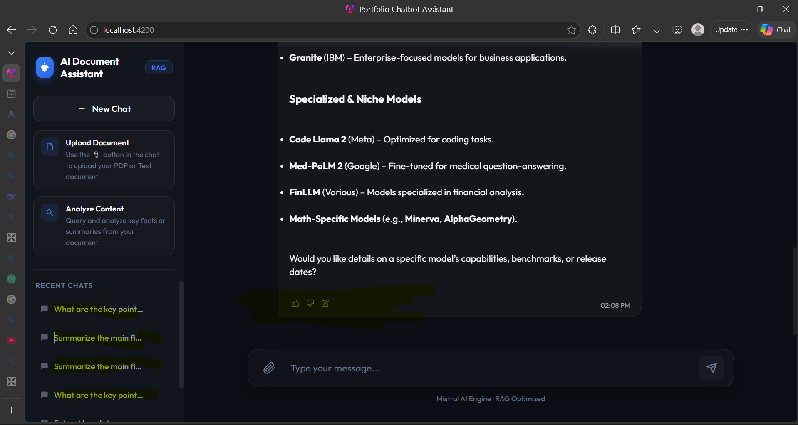

# Portfolio AI Chatbot (Advanced RAG Assistant)

A premium, state-of-the-art AI Chatbot platform built with a **Hybrid RAG (Retrieval-Augmented Generation)** architecture. This application allows users to interact with an intelligent assistant that can answer general knowledge questions and perform deep analysis on uploaded documents.

## 🚀 Key Features

-   **Hybrid AI Engine**: Seamlessly switches between general LLM reasoning and document-specific retrieval (RAG) based on context.
-   **Intelligent Document Ingestion**: Supports PDF and Text file parsing with advanced chunking and embedding generation.
-   **Optimized Vector Search**: Custom Java-based **Cosine Similarity** algorithm for high-performance context retrieval without database-level complexity.
-   **ChatGPT-Inspired UX**:
    *   **Glassmorphism Aesthetic**: Modern dark mode with translucent panels and vivid accents.
    *   **Inline Editing**: Edit your prompts directly within the message bubble to refine your queries.
    *   **One-Click Copy**: Fast clipboard integration with visual click feedback and tooltips.
    *   **Typing Indicators**: Smooth micro-animations for real-time interaction feel.
-   **Multi-Session Management**: Robust sidebar logic for creating, naming, and isolating multiple chat conversations.
-   **Feedback & Correction System**: Suggest corrections to AI responses to help improve accuracy and build a localized knowledge base.

## 🛠️ Technology Stack

### Backend
-   **Java 21** & **Spring Boot 3.x**
-   **Spring Data JPA**: For reliable PostgreSQL integration.
-   **PostgreSQL**: Primary data store for chat history and document chunks.
-   **In-Memory Learning**: Custom Cosine Similarity logic implemented in Java for blazing-fast similarity searches.
-   **Mistral AI Integration**: Powered by state-of-the-art Large Language Models.

### Frontend
-   **Angular**: Component-based architecture for a scalable SPA.
-   **Vanilla CSS + Tailwind**: Custom-crafted Design System using CSS variables for a premium "Vivid" aesthetic.
-   **Outfit Typography**: Clean, modern font selection from Google Fonts.
-   **Marked.js**: Full Markdown support for AI responses (code blocks, tables, lists).

### Prerequisites
-   JDK 21 or higher
-   Maven 3.x
-   Node.js (LTS version)
-   PostgreSQL instance

## 🖼️ Application Walkthrough

### 🏠 Home Page
The initial entry point showcasing the clean, glassmorphism design and quick suggestions.

### New Chat Interface

### 📄 Document Ingestion
Uploading and analyzing documents in real-time with visual processing feedback.

### ✅ Knowledge Integration
The system confirms when the document has been successfully indexed and is ready for querying.

### 🔍 RAG Querying
Asking complex questions based on the uploaded content and receiving context-aware responses.

### 🕒 Chat History & Feedback
Managing multiple sessions and providing feedback on AI responses to improve accuracy.

## 🏗️ Architecture
The system uses a **Session-Isolated RAG** model. When a document is uploaded, it is:
1.  **Parsed**: Text is extracted and cleaned.
2.  **Chunked**: Split into manageable semantic pieces.
3.  **Embedded**: Converted into high-dimensional vectors via an embedding model.
4.  **Stored**: Chunks and vectors are saved to PostgreSQL via standard JPA mappings.
5.  **Retrieved**: On query, the system calculates similarity in-memory for the specific session, ensuring data privacy and high speed.

## 📜 License
This project is licensed under the MIT License - see the [LICENSE](LICENSE) file for details.

---
*Built with ❤️ by [Your Name]*
